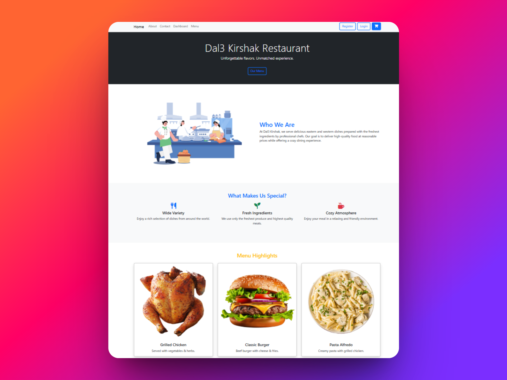

# Dal3 Kirshak

**Dal3 Kirshak** is a modern and responsive food ordering and restaurant management web application built with React.  
It provides a simple and elegant dashboard to view orders, track revenue, and manage food items easily.

---

## Preview



---

## Features

- Real-time Dashboard with statistics
- Recent orders list with status
- Daily revenue tracker
- Customer tracking
- Menu item management
- Fully responsive layout for mobile and desktop

---

## Tech Stack

- **Frontend:** React.js, Bootstrap 5
- **Styling:** Custom CSS + Bootstrap classes
- **Icons & Badges:** Bootstrap utilities

---

## Responsive Design

The app is fully responsive and mobile-friendly. Whether on desktop or mobile, the layout adapts seamlessly to all screen sizes.

---

---

## Screenshots

> You can include your screenshots like this below:

- Home page  
  
  
  

- Dashboard page
  

- About page
  

- Contact page
  

- Menu page
  

- Cart page
  

- Payment page
  

- Login page
  

- Register page
  

---

## 📌 How to Run Locally

1. Clone the repository:

   ```bash
   git clone https://github.com/mahmoudrabbas/dal3-kirshak.git
   ```

2. cd dal3-kirshak
3. npm install
4. npm start
5. visit=> http://localhost:3000
